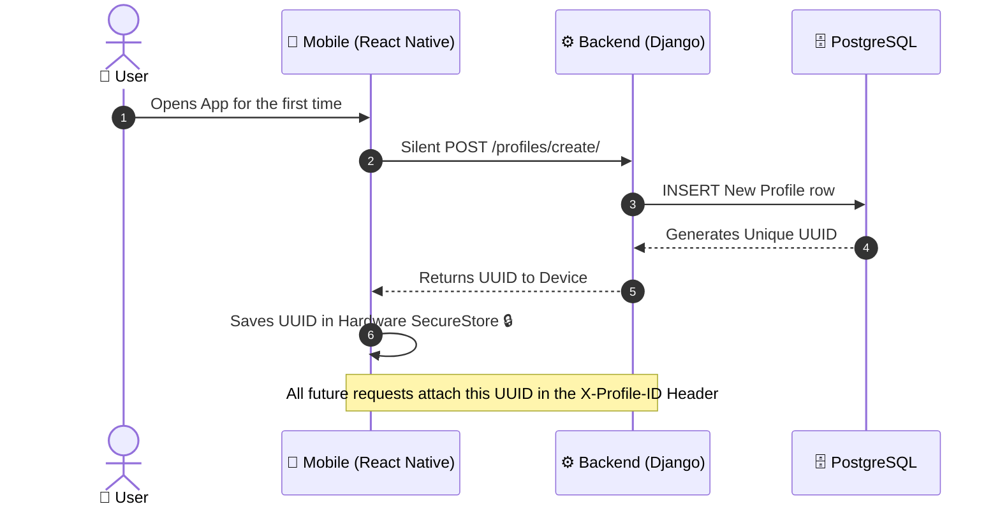
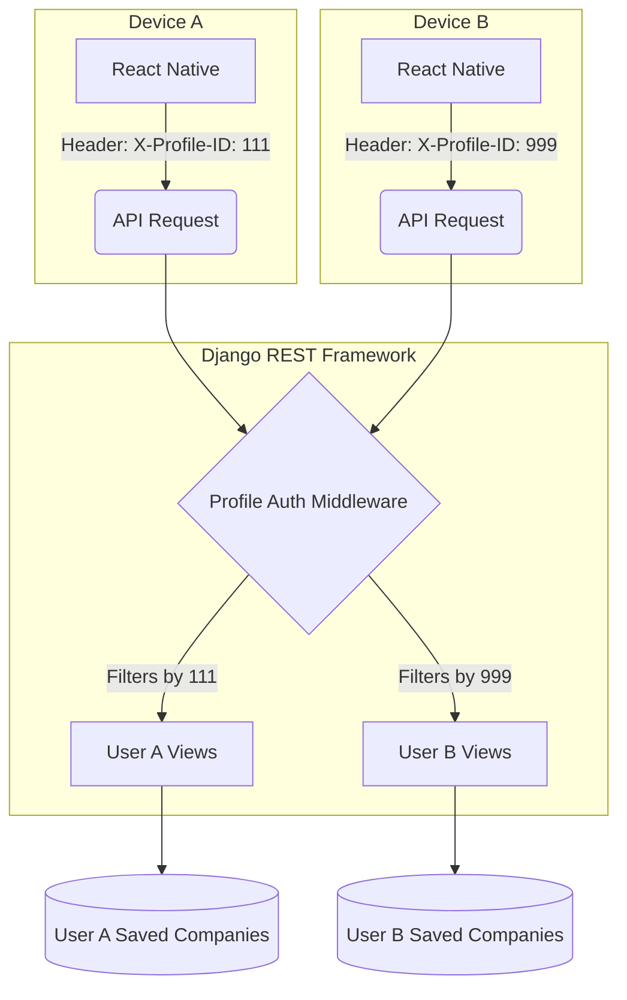
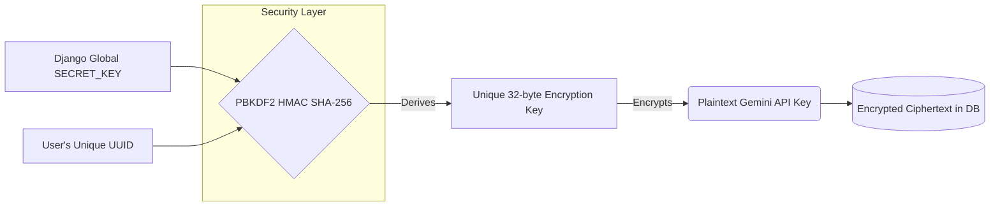

  
  <h1>📚 ProReach: Core Architecture & Systems</h1>
  
<i>A deep dive into frictionless multi-tenant architecture and dynamic cryptography.</i>

---

## 🚀 1. Frictionless Onboarding (Device-Bound Auth)

Traditional apps force users through tedious sign-up forms. ProReach removes **all friction** by using a hardware-linked, device-bound profile system. 

When a user opens the app, a secure handshake happens silently in the background:

<b>💡 Click to see the technical advantages of this approach:</b>

 
<ul>
  <li><b>Zero Friction:</b> The user is immediately dropped into the app experience.</li>
  <li><b>Stateless Auth:</b> No JWTs or session cookies to manage or expire.</li>
  <li><b>High Privacy:</b> No personal emails or phone numbers are stored in the database just to use the app.</li>
</ul>

---

## 🛡️ 2. Total Data Isolation

Because the system is strictly bound to the `UUID`, every user operates in a completely isolated environment on the server. The `ProfileAuthentication` middleware acts as a firewall between users.

---

## 🔐 3. User-Specific Dynamic Encryption

Handling user credentials (like Google Gemini API keys and Gmail App Passwords) requires extreme security. **We do not use a single master key to encrypt the database.** Instead, ProReach uses **Dynamic Key Derivation**.

Every single user has their own unique encryption lock.

---

## 🛑 4. Automated Full-Stack Workflow

To fully understand the power of ProReach, here is a visual representation of how data flows from the user's device, through our orchestrating Django API, to Google Gemini, and finally to the recruiter's inbox.

  <!-- This SVG contains embedded CSS animations and gradients! -->
  

### Workflow Breakdown:
1. **User Input:** The user pastes a company name and job description in the React Native UI.
2. **Context Enrichment:** The Django API receives the payload and automatically appends the user's saved Tech Stack and Experience level.
3. **AI Generation:** The payload is sent to the Google Gemini LLM, which returns a highly personalized pitch.
4. **Background Dispatch:** Instead of freezing the mobile UI, Django spins up a background thread that connects to Gmail SMTP, wraps the pitch in an HTML theme, and fires it off to the recruiter.

---

## ⚠️ Limitations & Trade-offs

To achieve this level of privacy and zero-friction onboarding, we made an intentional architectural trade-off:

| Feature | Trade-off Explained |
| :--- | :--- |
| **No Cloud Syncing** | Because there is no central email/password login, if a user uninstalls the app or changes their physical phone, their locally stored UUID is deleted. |
| **Clean Slates** | Reinstalling the app will generate a brand new UUID, acting as a complete reset. This maximizes privacy (data isn't lingering attached to an email address forever). |

---

## ✨ 5. Core Application Features

Beyond the core architecture, ProReach implements several complex features to enhance the user experience and the final product delivered to recruiters:

### 🎨 Dynamic HTML Email Themes
ProReach does not send boring plain-text emails. Before dispatching the email via SMTP, the Django backend wraps the Gemini-generated pitch into one of several professionally designed, responsive HTML templates (e.g., *Void Purple*, *Soft Bento*, *Minimal Resume*). This ensures the application instantly stands out in a crowded inbox.

### 📎 Automated Resume Attachments
Users can upload their PDF resume once. The backend securely stores this file, and the background SMTP dispatcher automatically attaches the PDF to every outgoing pitch email, removing the need for the user to manually attach files every time they apply.

### 📊 History & Goal Tracking
The application features a robust history logging system. Every generated pitch and sent email is logged to the PostgreSQL database via a foreign key linked to the user's UUID. 
On the frontend, users have a highly interactive mechanical dial to set "Daily Pitch Goals" (e.g., 5 pitches a day), encouraging consistency in their job hunt.

### ⚡ TanStack Query State Management
To ensure a buttery smooth mobile experience, the React Native frontend utilizes **TanStack Query (React Query)**. This provides aggressive local caching of the user's profile and company history. When the app is opened, UI elements render instantly from the cache while background re-validation occurs, completely hiding any network latency from the user.

 

  <i>ProReach was designed to prioritize speed, execution, and local-first security.</i>

