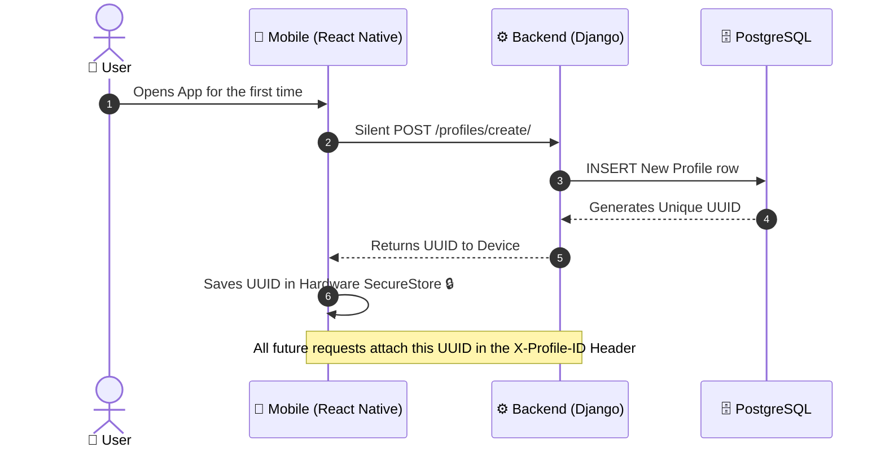
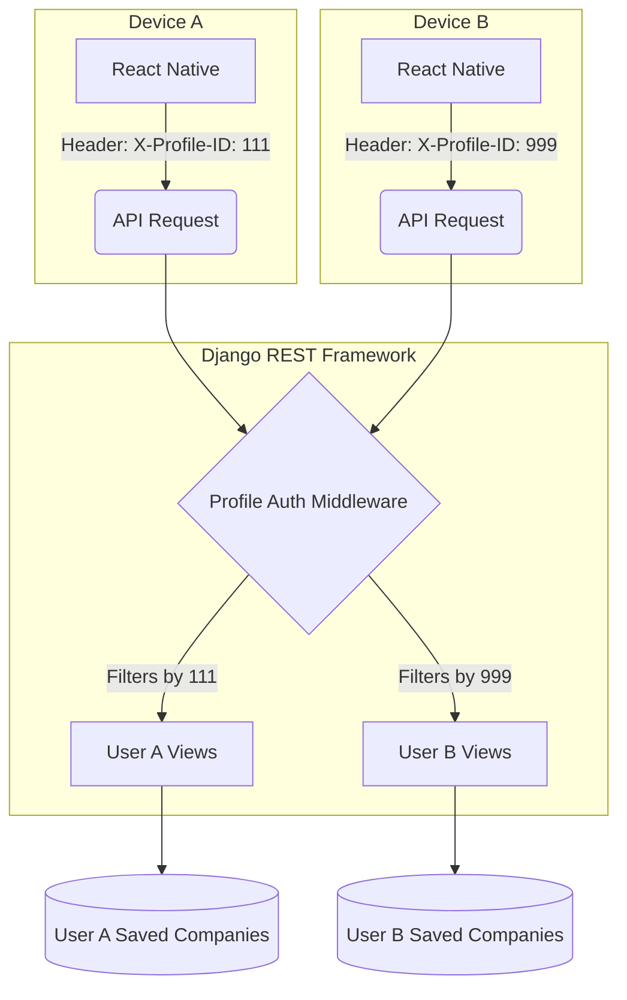
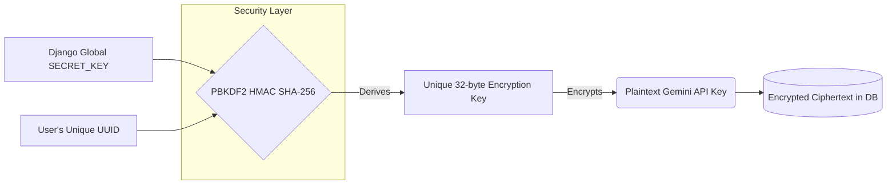
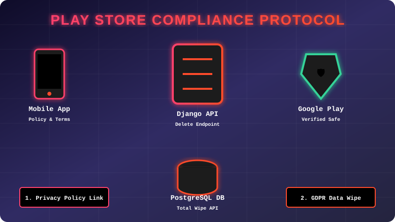

  
  <h1>📚 ProReach: Core Architecture & Systems</h1>
  
<i>A deep dive into frictionless multi-tenant architecture and dynamic cryptography.</i>

---

## 🚀 1. Frictionless Onboarding (Device-Bound Auth)

Traditional apps force users through tedious sign-up forms. ProReach removes **all friction** by using a hardware-linked, device-bound profile system. 

When a user opens the app, a secure handshake happens silently in the background:

<b>💡 Click to see the technical advantages of this approach:</b>

 
<ul>
  <li><b>Zero Friction:</b> The user is immediately dropped into the app experience.</li>
  <li><b>Stateless Auth:</b> No JWTs or session cookies to manage or expire.</li>
  <li><b>High Privacy:</b> No personal emails or phone numbers are stored in the database just to use the app.</li>
</ul>

---

## 🛡️ 2. Total Data Isolation

Because the system is strictly bound to the `UUID`, every user operates in a completely isolated environment on the server. The `ProfileAuthentication` middleware acts as a firewall between users.

---

## 🔐 3. User-Specific Dynamic Encryption

Handling user credentials (like Google Gemini API keys and Gmail App Passwords) requires extreme security. **We do not use a single master key to encrypt the database.** Instead, ProReach uses **Dynamic Key Derivation**.

Every single user has their own unique encryption lock.

---

## 🛑 4. Google Play Store Compliance Protocol

Preparing an app for public distribution requires strict adherence to privacy and data deletion policies. To ensure ProReach is 100% compliant with Google Play Store regulations, we implemented a dedicated **Compliance Architecture**.

  <!-- This SVG contains embedded CSS animations, gradients, and cyberpunk aesthetics! -->
  

### Core Compliance Features:
1. **The "Right to be Forgotten" API:** We upgraded the "Wipe Profile" feature. It doesn't just clear local storage—it actively fires a `DELETE` request to the Django backend to totally erase the user's UUID and all encrypted data from the PostgreSQL database, satisfying GDPR and Google Play's strict data deletion requirements.
2. **Transparent Privacy Policy:** Links directly to a hosted privacy page to explain exactly how device-bound UUIDs work.
3. **Gmail App Password Clarity:** Explicitly guiding users to generate secure Google App Passwords instead of entering primary Google Account passwords to avoid "Deceptive Behavior" flags during app review.

---

## ⚠️ Limitations & Trade-offs

To achieve this level of privacy and zero-friction onboarding, we made an intentional architectural trade-off:

| Feature | Trade-off Explained |
| :--- | :--- |
| **No Cloud Syncing** | Because there is no central email/password login, if a user uninstalls the app or changes their physical phone, their locally stored UUID is deleted. |
| **Clean Slates** | Reinstalling the app will generate a brand new UUID, acting as a complete reset. This maximizes privacy (data isn't lingering attached to an email address forever). |

 

  <i>ProReach was designed to prioritize speed, execution, and local-first security.</i>

