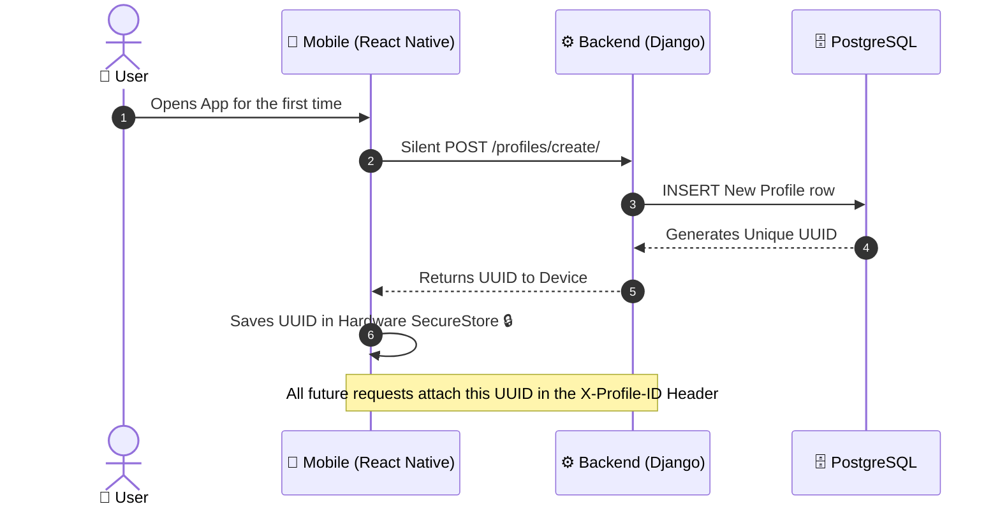
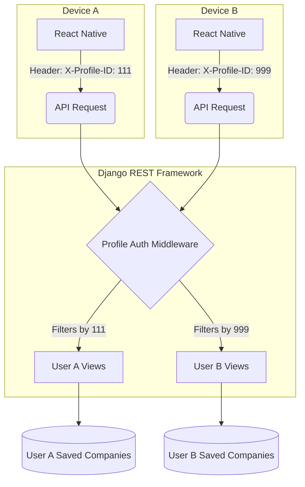
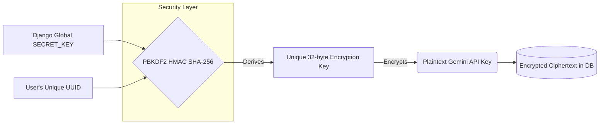
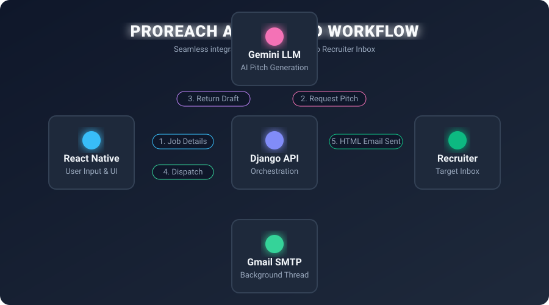
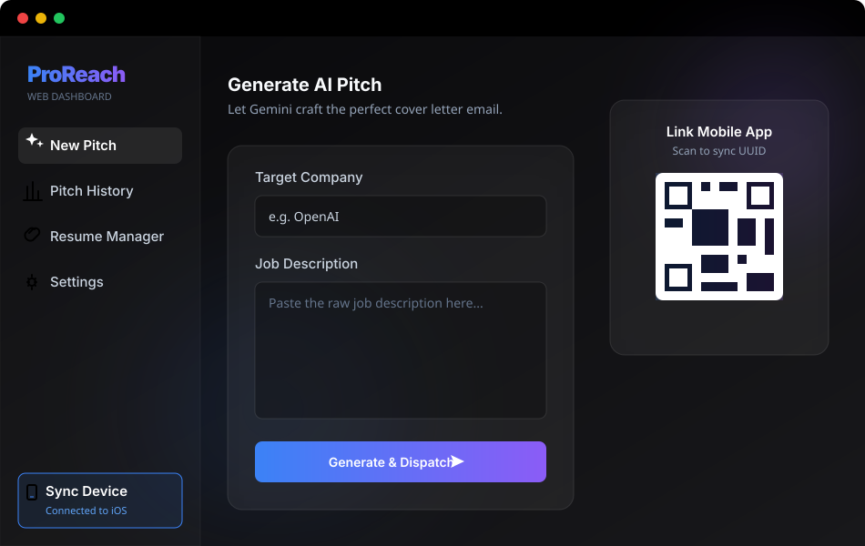

  
  <h1>📚 ProReach: Core Architecture & Systems</h1>
  
<i>A deep dive into frictionless multi-tenant architecture and dynamic cryptography.</i>

---

## 🚀 1. Frictionless Onboarding (Device-Bound Auth)

Traditional apps force users through tedious sign-up forms. ProReach removes **all friction** by using a hardware-linked, device-bound profile system. 

When a user opens the app, a secure handshake happens silently in the background:

<b>💡 Click to see the technical advantages of this approach:</b>

 
<ul>
  <li><b>Zero Friction:</b> The user is immediately dropped into the app experience.</li>
  <li><b>Stateless Auth:</b> No JWTs or session cookies to manage or expire.</li>
  <li><b>High Privacy:</b> No personal emails or phone numbers are stored in the database just to use the app.</li>
</ul>

---

## 🛡️ 2. Total Data Isolation

Because the system is strictly bound to the `UUID`, every user operates in a completely isolated environment on the server. The `ProfileAuthentication` middleware acts as a firewall between users.

---

## 🔐 3. User-Specific Dynamic Encryption

Handling user credentials (like Google Gemini API keys and Gmail App Passwords) requires extreme security. **We do not use a single master key to encrypt the database.** Instead, ProReach uses **Dynamic Key Derivation**.

Every single user has their own unique encryption lock.

---

## 🛑 4. Automated Full-Stack Workflow

To fully understand the power of ProReach, here is a visual representation of how data flows from the user's device, through our orchestrating Django API, to Google Gemini, and finally to the recruiter's inbox.

  <!-- This SVG contains embedded CSS animations and gradients! -->
  

### Workflow Breakdown:
1. **User Input:** The user pastes a company name and job description in the React Native UI.
2. **Context Enrichment:** The Django API receives the payload and automatically appends the user's saved Tech Stack and Experience level.
3. **AI Generation:** The payload is sent to the Google Gemini LLM, which returns a highly personalized pitch.
4. **Background Dispatch:** Instead of freezing the mobile UI, Django spins up a background thread that connects to Gmail SMTP, wraps the pitch in an HTML theme, and fires it off to the recruiter.

---

## ⚠️ Limitations & Trade-offs

To achieve this level of privacy and zero-friction onboarding, we made an intentional architectural trade-off:

| Feature | Trade-off Explained |
| :--- | :--- |
| **No Cloud Syncing** | Because there is no central email/password login, if a user uninstalls the app or changes their physical phone, their locally stored UUID is deleted. |
| **Clean Slates** | Reinstalling the app will generate a brand new UUID, acting as a complete reset. This maximizes privacy (data isn't lingering attached to an email address forever). |

---

## ✨ 5. Core Application Features

Beyond the core architecture, ProReach implements several complex features to enhance the user experience and the final product delivered to recruiters:

### 🎨 Dynamic HTML Email Themes
ProReach does not send boring plain-text emails. Before dispatching the email via SMTP, the Django backend wraps the Gemini-generated pitch into one of several professionally designed, responsive HTML templates (e.g., *Void Purple*, *Soft Bento*, *Minimal Resume*). This ensures the application instantly stands out in a crowded inbox.

### 📎 Automated Resume Attachments
Users can upload their PDF resume once. The backend securely stores this file, and the background SMTP dispatcher automatically attaches the PDF to every outgoing pitch email, removing the need for the user to manually attach files every time they apply.

### 📊 History & Goal Tracking
The application features a robust history logging system. Every generated pitch and sent email is logged to the PostgreSQL database via a foreign key linked to the user's UUID. 
On the frontend, users have a highly interactive mechanical dial to set "Daily Pitch Goals" (e.g., 5 pitches a day), encouraging consistency in their job hunt.

### ⚡ TanStack Query State Management
To ensure a buttery smooth mobile experience, the React Native frontend utilizes **TanStack Query (React Query)**. This provides aggressive local caching of the user's profile and company history. When the app is opened, UI elements render instantly from the cache while background re-validation occurs, completely hiding any network latency from the user.

---

## 🔮 6. Future Ecosystem Expansion

Because ProReach relies on a headless **Django REST API** architecture, the backend is entirely decoupled from the frontend. This opens the door for massive ecosystem expansion without needing to rewrite any backend logic.

  <!-- CSS/SVG Mockup of the Future Web App -->
  

### Web Application Port
The API can seamlessly support a web-based frontend (e.g., built with Next.js or React). A web client would simply interact with the exact same endpoints (`https://job-email-app.onrender.com/api/v1/`). Instead of using mobile `SecureStore`, the web app would store the generated `UUID` inside the browser's `localStorage` to maintain the frictionless, password-less authentication flow.

### Cross-Device Syncing (Mobile ↔ Web)
To bridge the gap between a mobile app and a web platform, a "Sync Device" feature is planned:
1. The mobile app can generate a secure QR code or display the user's raw `UUID`.
2. On the web app, the user selects "Link Existing Account" and inputs this code.
3. The web app stores the UUID in `localStorage`, instantly synchronizing company history, pitches, and settings across both devices, since both clients are querying the same backend database row.

---

## 🛠️ 7. Advanced Technical Implementations

To make the app truly production-ready, several advanced techniques were used to guarantee a seamless user experience and bulletproof backend stability.

### Asynchronous Non-Blocking Dispatch
Connecting to Gmail SMTP servers and attaching PDF files can take anywhere from 1 to 4 seconds depending on network conditions. If the Django backend performed this synchronously, the user's mobile app would freeze on a loading screen, causing terrible UX.
Instead, the Django API instantly queues the email task into a **Background Python Thread** (`threading.Thread`).
* The API returns a `200 OK` response in **under 200ms**, allowing the mobile UI to instantly show a success animation.
* The background thread safely acquires a fresh database connection (`close_old_connections()`), dispatches the SMTP payload, and updates the `EmailLog` database row silently in the background.

### Dynamic Input Sanitization (UX Defense)
When users generate a Google App Password, Google formats it with spaces (e.g., `abcd efgh ijkl mnop`). If sent raw to an SMTP server, the authentication will crash. 
The ProReach backend implements silent input sanitization on all credentials (stripping whitespaces, trimming edges) just before the KDF encryption layer and SMTP dispatch. This means the app acts as a defensive shield against user-error—no matter how messy the user pastes their API keys or passwords, the backend cleans it and processes it flawlessly.

---

## 🏗️ 8. Infrastructure Scaling & Data Persistence Plan

> [!WARNING]
> **Current MVP Limitation:** During the testing phase on Render's free tier, you may notice that **every time backend code is updated and deployed, all user profile data gets wiped out.**

### 🚨 The Root Cause: Ephemeral Filesystems
Free-tier cloud servers utilize an **Ephemeral Filesystem**. 
- 🔄 **The Wipe:** When a new deployment occurs, the cloud provider destroys the old server container and creates a brand new one. Because the database is stored locally inside that container (`db.sqlite3`), it is permanently erased.
- 💥 **The Conflict:** The mobile app retains the old `UUID` in its hardware `SecureStore`. When it attempts to communicate with the newly spun-up backend, the server rejects it (since the UUID no longer exists in its fresh database), resulting in a broken profile state.

### 🚀 The Production Migration Plan
To guarantee absolute data safety and prevent data loss during future backend updates, the following infrastructure upgrades are planned for the production release:

| Objective | Implementation Plan | End Result |
| :--- | :--- | :--- |
| **1. Database Decoupling** | Migrate to a managed Cloud PostgreSQL provider (e.g., Supabase, Neon). | The database lives on an independent server and is **never** wiped during application code updates. |
| **2. Graceful App Resilience** | Update React Native to automatically detect "Orphaned UUIDs" (404 Not Found). | The app catches the error, wipes its local memory, and silently generates a new profile without crashing. |

 

  <i>ProReach was designed to prioritize speed, execution, and local-first security.</i>

