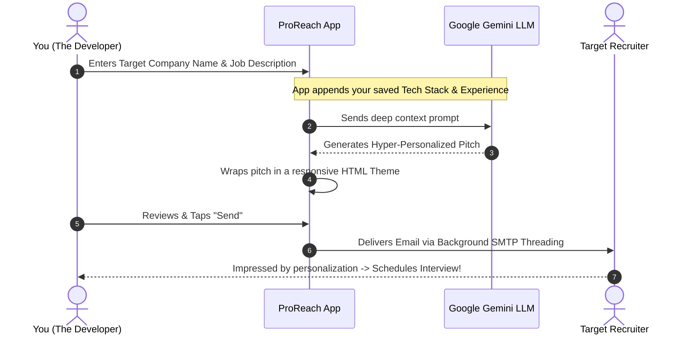
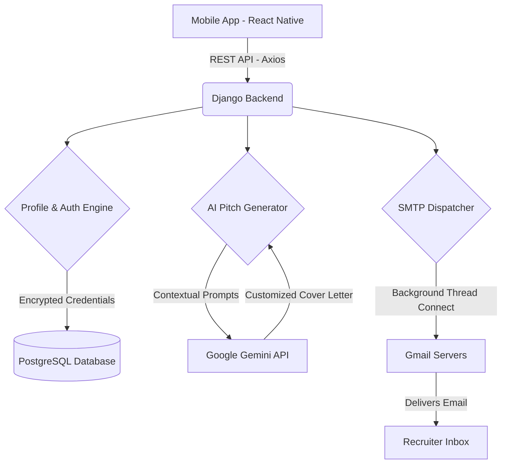

<h1 align="center">
  <br>
  
  <br>
  ProReach 🚀
  <br>
</h1>

<h4 align="center">Your Personal AI Career Assistant. Automate Job Applications with Google Gemini.</h4>

<p align="center">
  <a href="#the-problem--the-solution">The Solution</a> •
  <a href="#-workflow-diagram">How It Works</a> •
  <a href="#-developers-diary-why-i-built-this">Developer's Diary</a> •
  <a href="#-architecture">Architecture</a> •
  <a href="#-tech-stack">Tech Stack</a>
</p>


---

## 🛑 The Problem & The Solution

**The Problem:** The modern job hunt is exhausting. Writing a generic email gets you ignored. Writing a highly personalized, well-researched cold email takes 30+ minutes per application. Scaling that effort is impossible.

**The Solution:** **ProReach.** By mapping a company's specific job requirements directly to your saved tech stack and experience level, ProReach acts as a bridge. It leverages Google Gemini AI to draft a hyper-personalized, professional pitch in *seconds*, and sends it directly to the recruiter's inbox via integrated SMTP.

---

## 🌊 Workflow Diagram

Here is exactly how ProReach automates the application cycle from end-to-end:



---

## 📖 Developer's Diary: Why I Built This

> *"We spend years learning to code, only to spend hours copy-pasting the same cover letter over and over."*

When I started applying for roles, I noticed a painful pattern. The jobs I actually heard back from were the ones where I took 30 minutes to heavily personalize my cold email. But doing that for 50+ companies? It was burning me out.

I realized I didn't need to work harder—I needed a system. 
I built **ProReach** as a personal engineering challenge: *Could I seamlessly bridge a mobile frontend with Google's Gemini LLM to act as my personal career agent?* 

What started as a simple idea evolved into a complex full-stack architecture. During this project, I engineered real-world solutions to complex problems:
* **Security:** Handled secure local encryption (Expo SecureStore) so Gmail App Passwords and API keys never touch the database in plaintext.
* **Performance:** Implemented Python background threading in Django so SMTP network delays don't freeze the React Native UI.
* **Design:** Designed a buttery-smooth, mechanical "bento-box" aesthetic because the tools you use every day should feel premium.

ProReach isn't just an app; it's a testament to solving your own bottlenecks through code.

---

## 🗺 System Architecture



---

## 🛠 Tech Stack

### Frontend (Mobile App)
* **Framework:** React Native / Expo
* **Language:** TypeScript
* **State Management:** React Context API & TanStack Query
* **Animations:** React Native Reanimated

### Backend (API & AI)
* **Framework:** Django & Django REST Framework (DRF)
* **Database:** PostgreSQL (Production)
* **AI Integration:** Google Generative AI (Gemini 1.5)
* **Deployment:** Render (Gunicorn + WhiteNoise)

---

## 💻 Local Installation

### 1. Clone the repository
```bash
git clone https://github.com/gautam1432002/Job-Email-App.git
cd Job-Email-App
```

### 2. Backend Setup
```bash
cd backend/jobmailer
python -m venv venv
source venv/bin/activate  # On Windows: venv\Scripts\activate
pip install -r requirements.txt
python manage.py migrate
python manage.py runserver 0.0.0.0:8000
```

### 3. Frontend Setup
```bash
cd frontend
npm install
npx expo start --clear
```

---
<p align="center">Made with ❤️ by Gautam</p>
