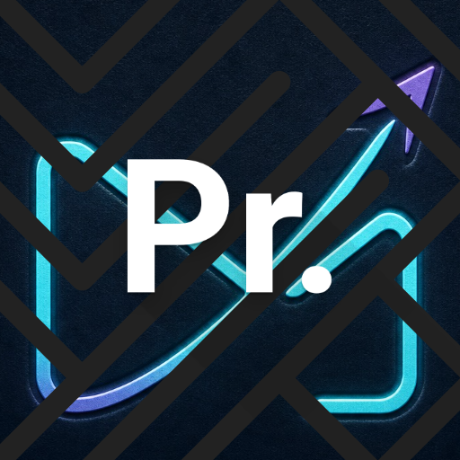
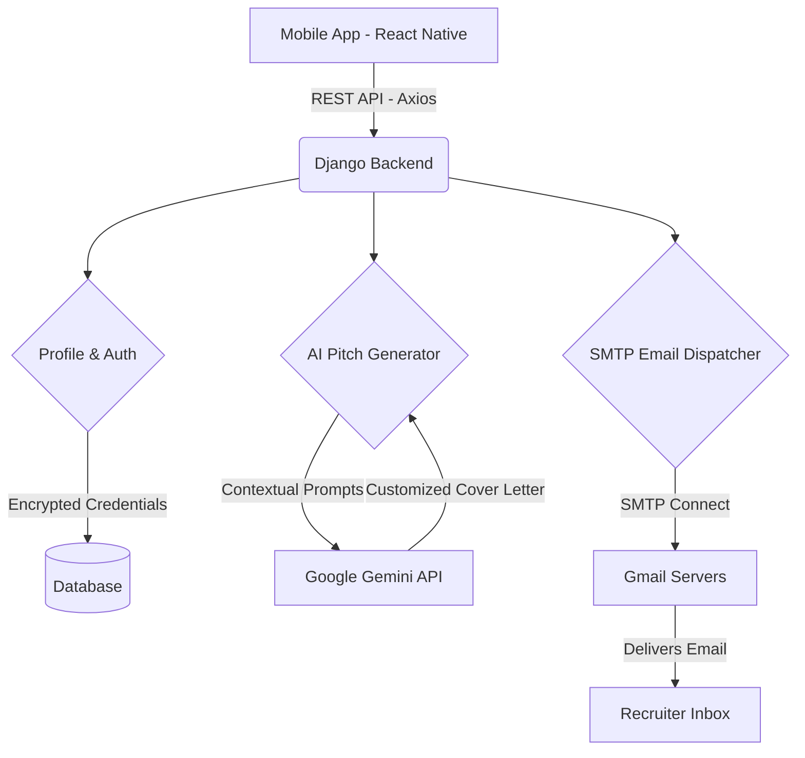

<h1 align="center">
  <br>
  
  <br>
  ProReach 🚀
  <br>
</h1>

<h4 align="center">Your Personal AI Career Assistant. Automate Job Applications with Google Gemini.</h4>

<p align="center">
  <a href="#key-features">Key Features</a> •
  <a href="#tech-stack">Tech Stack</a> •
  <a href="#architecture">Architecture</a> •
  <a href="#how-to-use">How To Use</a> •
  <a href="#installation">Installation</a>
</p>


---

## 🎯 What is ProReach?
Tired of spending hours writing the perfect cover letter or cold email for every single job application? **ProReach** automates the hardest part of the job hunt so you can focus on preparing for the interview.

Powered by advanced Google Gemini AI, ProReach instantly analyzes a company’s profile, matches it with your unique tech stack and experience, and generates a highly personalized, professional pitch designed specifically to catch a recruiter's eye.

## ✨ Key Features
* 🤖 **One-Tap AI Email Generation:** Just paste the recruiter's email and company name. Our AI drafts a tailored, professional pitch instantly based on your profile.
* 📨 **Seamless Gmail Integration:** Securely connect your Gmail account to send applications directly from the app. No need to copy-paste between apps!
* 🧠 **Smart Profile Context:** Add your experience level (e.g., "2 Years", "Fresher") and your Tech Stack. The AI remembers this and intelligently weaves your skills into every email.
* 📊 **Built-In History Tracking:** Never lose track of who you applied to. Automatically log and view all your sent applications in an intuitive dashboard.
* 🎨 **Premium Aesthetic UI:** A gorgeous, mechanical "dark mode" design built for productivity with buttery smooth Reanimated transitions.
* 🔒 **Privacy First:** Your data belongs to you. Gmail App Passwords and API keys are stored securely and encrypted locally on your device.

## 🛠 Tech Stack

### Frontend (Mobile App)
* **Framework:** React Native / Expo
* **Language:** TypeScript
* **State Management:** React Context API & TanStack Query (React Query)
* **Animations:** React Native Reanimated
* **Local Storage:** Expo SecureStore & AsyncStorage

### Backend (API & AI)
* **Framework:** Django & Django REST Framework (DRF)
* **Database:** PostgreSQL (Production) / SQLite (Development)
* **AI Integration:** Google Generative AI (Gemini 1.5 Pro/Flash)
* **Email Dispatch:** SMTP via background threading
* **Deployment:** Render (Gunicorn + WhiteNoise)

## 🗺 Architecture Mindmap



## 🚀 How To Use
1. **Create a Profile:** Enter your role, experience level, and tech stack.
2. **Add Integrations:** Securely add your Google Gemini API key and Gmail App Password in settings.
3. **Draft a Pitch:** Enter the target company name and job description. Let Gemini generate a customized email.
4. **Send & Track:** Review the email, choose a visual HTML theme (optional), and hit send. The app logs it to your history instantly!

## 💻 Installation (Local Development)

### Prerequisites
* Node.js & npm
* Python 3.10+
* Expo Go app on your mobile device

### 1. Clone the repository
```bash
git clone https://github.com/yourusername/ProReach.git
cd ProReach
```

### 2. Backend Setup
```bash
cd backend/jobmailer
python -m venv venv
source venv/bin/activate  # On Windows: venv\Scripts\activate
pip install -r requirements.txt
python manage.py migrate
python manage.py runserver 0.0.0.0:8000
```

### 3. Frontend Setup
```bash
cd frontend
npm install
npx expo start --clear
```
*Scan the QR code with your Expo Go app to start testing!*

---
<p align="center">Made with ❤️ by an AI Innovator</p>
